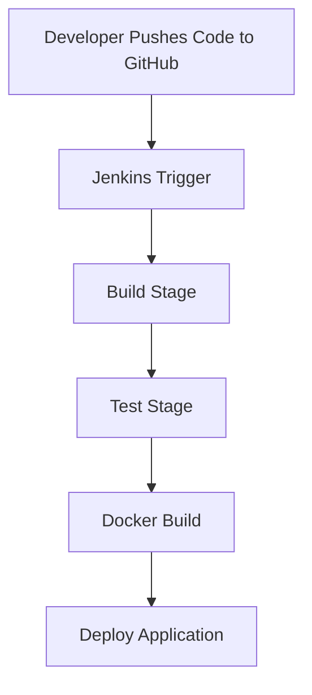

# 🚀 CI/CD Pipeline Automation System

An end-to-end Continuous Integration and Continuous Deployment (CI/CD) pipeline that automatically builds, tests, and deploys applications on every Git push using **Jenkins, Docker, and GitHub**.

---

## 📌 Problem Statement

Design and implement a CI/CD pipeline that:

* Automatically **builds**, **tests**, and **deploys** code
* Gets triggered on every **Git push**
* Ensures faster and reliable software delivery

---

## 🛠️ Tech Stack

* **Version Control:** GitHub
* **CI/CD Tool:** Jenkins
* **Containerization:** Docker

---

## ⚙️ Pipeline Workflow



### 🔁 Step-by-Step Flow

1. Developer pushes code to GitHub repository
2. Jenkins detects the change via webhook
3. Jenkins pipeline starts automatically
4. Code is built and dependencies are installed
5. Automated tests are executed
6. Docker image is created
7. Application is deployed

---

## 📂 Project Structure

```
.
├── Jenkinsfile
├── Dockerfile
├── app.js
├──package.json
└── README.md
```

---

## 🧪 Jenkins Pipeline (Jenkinsfile)

```groovy
pipeline {
    agent any

    stages {
        stage('Clone Repository') {
            steps {
                git 'https://github.com/your-username/your-repo.git'
            }
        }

        stage('Build') {
            steps {
                sh 'echo Building application...'
                sh 'npm install' // or pip install -r requirements.txt
            }
        }

        stage('Test') {
            steps {
                sh 'echo Running tests...'
                sh 'npm test' // or pytest
            }
        }

        stage('Docker Build') {
            steps {
                sh 'docker build -t my-app .'
            }
        }

        stage('Deploy') {
            steps {
                sh 'docker run -d -p 3000:3000 my-app'
            }
        }
    }
}
```

---

## 🐳 Docker Configuration

```dockerfile
FROM node:18

WORKDIR /app

COPY package*.json ./
RUN npm install

COPY . .

EXPOSE 10000

CMD ["npm", "start"]
```

---

## 🔗 Deployment Link

👉 **Live Application:**

```

https://cicd-demo-7.onrender.com/

---

## 📈 Features

* 🔄 Fully automated CI/CD pipeline
* 🚀 Instant deployment on code push
* 🐳 Containerized application
* ✅ Integrated testing phase
* ⚡ Faster release cycles

---

## 📌 Future Improvements

* Add Kubernetes deployment
* Implement monitoring (Prometheus + Grafana)
* Add rollback strategy
* Integrate security scanning

---

## 👨‍💻 Author

**Your Name**
GitHub: https://github.com/devsomya28

---

## ⭐ Conclusion

This project demonstrates a real-world **CI/CD pipeline automation system** that improves development speed, reduces errors, and ensures consistent deployments using modern DevOps tools.

---
